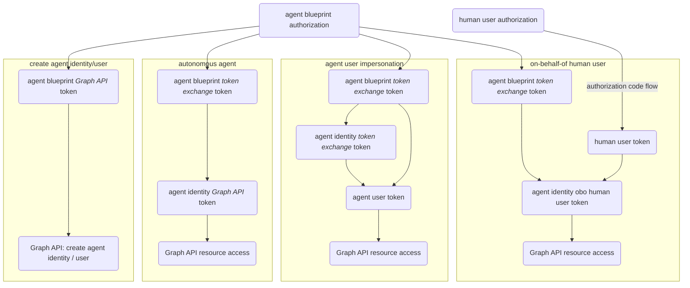

## 1. Entra agent identity authorization flows



## 2. Get agent blueprint token

### 2.1. Graph API access token

Agent blueprint needs to access Graph API to create agent identity and agent user

The `scope` used in the _access_ token request for Graph API is `https://graph.microsoft.com/.default`

#### 2.1.A. Using client secret

```pwsh
$body=@{
  client_id = $AgentIdBp.id
  client_secret = $AgentIdBpPw.secretText
  grant_type = 'client_credentials'
  scope = 'https://graph.microsoft.com/.default'
}
Invoke-RestMethod $token_endpoint -Method Post -Body $body | Tee-Object -Variable tokenAgentIdBp
$headersAgentIdBp = @{ Authorization='Bearer '+$tokenAgentIdBp.access_token }
```

#### 2.1.B. Using FIC (e.g. using Azure VM to get managed identity token)

##### 2.1.B.1. Get exchange token for MI [ᵈᵒᶜ](https://learn.microsoft.com/en-us/entra/identity/managed-identities-azure-resources/how-to-use-vm-token)

```pwsh
$endpointuri = 'http://169.254.169.254/metadata/identity/oauth2/token?api-version=2018-02-01&resource=api://AzureADTokenExchange'
Invoke-RestMethod $endpointuri -Headers @{Metadata="true"} | Tee-Object -Variable tokenMI
$tokenMI.access_token
```

##### 2.1.B.2. Exchange MI token for agent blueprint token [ᵈᵒᶜ](https://learn.microsoft.com/en-us/entra/agent-id/identity-platform/create-delete-agent-identities#get-an-access-token-using-agent-identity-blueprint)

```pwsh
$body=@{
  client_id = $AgentIdBp.id
  client_assertion_type = 'urn:ietf:params:oauth:client-assertion-type:jwt-bearer'
  client_assertion = $tokenMI.access_token
  grant_type = 'client_credentials'
  scope = 'https://graph.microsoft.com/.default'
}
Invoke-RestMethod $token_endpoint -Method Post -Body $body | Tee-Object -Variable tokenAgentIdBp
$headersAgentIdBp = @{ Authorization='Bearer '+$tokenAgentIdBp.access_token }
```

#### 2.1.1. Example agent blueprint Graph API access token

Notice:
1. `aud`: `https://graph.microsoft.com`
2. `iss`: `https://sts.windows.net/<tenant-id>/`
3. `appid`: `8a22dfd8-f315-4ee1-be84-c5f46a5b0b3c` (agent bluepint object ID)
4. `oid`, `sub`: `12d1b58c-d6e1-4b90-a8de-e8a8cecfb46d` (agent bluepint principal object ID)
5. `roles`: `AgentIdUser.ReadWrite.IdentityParentedBy` + `AgentIdentity.CreateAsManager`

```json
{
  "aud": "https://graph.microsoft.com",
  "iss": "https://sts.windows.net/323626f5-1bfe-48cd-8902-ddfdfd44e1ce/",
  "iat": 1772364461,
  "nbf": 1772364461,
  "exp": 1772368361,
  "aio": "k2ZgYNg2pdm/lHebXKiZEWfd8yZvAA==",
  "app_displayname": "episilon-AgentIdentityBlueprint",
  "appid": "8a22dfd8-f315-4ee1-be84-c5f46a5b0b3c",
  "appidacr": "1",
  "idp": "https://sts.windows.net/323626f5-1bfe-48cd-8902-ddfdfd44e1ce/",
  "idtyp": "app",
  "oid": "12d1b58c-d6e1-4b90-a8de-e8a8cecfb46d",
  "rh": "1.AWMB9SY2Mv4bzUiJAt39_UThzgMAAAAAAAAAwAAAAAAAAAAAAABjAQ.",
  "roles": [
    "AgentIdUser.ReadWrite.IdentityParentedBy",
    "AgentIdentity.CreateAsManager"
  ],
  "sub": "12d1b58c-d6e1-4b90-a8de-e8a8cecfb46d",
  "tenant_region_scope": "NA",
  "tid": "323626f5-1bfe-48cd-8902-ddfdfd44e1ce",
  "uti": "GQkNlJPZNEqUJ4reXrPGAA",
  "ver": "1.0",
  "wids": [
    "0997a1d0-0d1d-4acb-b408-d5ca73121e90"
  ],
  "xms_acd": 1772364424,
  "xms_act_fct": "9 3",
  "xms_ftd": "aJ0fGVJmcUPAXi_PkddSpAkraCC4y5v3plYyaTDRpYABdXNzb3V0aC1kc21z",
  "xms_idrel": "8 7",
  "xms_rd": "0.42LjYBJieswkJMLBLiQQtXu9kpAqp0cXn4lv9ZfXd4GinEICZQprV61WY_Xc-JqTP6la_DpQlENIgJkBAg5AaaAot5DAwT2Jb16_T91gHB85v-jC4tkA",
  "xms_sub_fct": "9 3",
  "xms_tcdt": 1752658764,
  "xms_tnt_fct": "10 3"
}
```

### 2.2. Token exchange token

Agent blueprint provides the credentials for agent identity and agent user authorization via token exchange

The `scope` used in the _token exchange_ token request for Graph API is `api://AzureADTokenExchange/.default`

#### 2.2.A. Using client secret

```pwsh
$body=@{
  client_id = $AgentIdBp.id
  client_secret = $AgentIdBpPw.secretText
  fmi_path = $AgentId.id
  grant_type = 'client_credentials'
  scope = 'api://AzureADTokenExchange/.default'
}
Invoke-RestMethod $token_endpoint -Method Post -Body $body | Tee-Object -Variable tokenAgentIdBp
```

#### 2.2.B. Using FIC (e.g. using Azure VM to get managed identity token)

##### 2.2.B.1. Get exchange token for MI [ᵈᵒᶜ](https://learn.microsoft.com/en-us/entra/identity/managed-identities-azure-resources/how-to-use-vm-token)

```pwsh
$endpointuri = 'http://169.254.169.254/metadata/identity/oauth2/token?api-version=2018-02-01&resource=api://AzureADTokenExchange'
Invoke-RestMethod $endpointuri -Headers @{Metadata="true"} | Tee-Object -Variable tokenMI
$tokenMI.access_token
```

##### 2.2.B.2. Exchange MI token for agent blueprint token [ᵈᵒᶜ](https://learn.microsoft.com/en-us/entra/agent-id/identity-platform/autonomous-agent-request-tokens#request-a-token-for-the-agent-identity-blueprint)

```pwsh
$body=@{
  client_id = $AgentIdBp.id
  client_assertion_type = 'urn:ietf:params:oauth:client-assertion-type:jwt-bearer'
  client_assertion = $tokenMI.access_token
  fmi_path = $AgentId.id
  grant_type = 'client_credentials'
  scope = 'api://AzureADTokenExchange/.default'
}
Invoke-RestMethod $token_endpoint -Method Post -Body $body | Tee-Object -Variable tokenAgentIdBp
```

#### 2.2.1. Example agent blueprint token exchange token

Notice:
1. `aud`: `fb60f99c-7a34-4190-8149-302f77469936` (AAD token exchange public endpoint)
2. `iss`: `https://login.microsoftonline.com/<tenant-id>/v2.0`
3. `azp` (authorized parties): `8a22dfd8-f315-4ee1-be84-c5f46a5b0b3c` (agent bluepint object ID)
4. `oid`: `12d1b58c-d6e1-4b90-a8de-e8a8cecfb46d` (agent bluepint principal object ID)
5. `sub`: `.../f3526a0b-788e-4f6c-bb3e-9864b45a3074` (agent identity object ID)
6. `roles`: _not present_

```json
{
  "aud": "fb60f99c-7a34-4190-8149-302f77469936",
  "iss": "https://login.microsoftonline.com/323626f5-1bfe-48cd-8902-ddfdfd44e1ce/v2.0",
  "iat": 1772364652,
  "nbf": 1772364652,
  "exp": 1772368552,
  "aio": "k2ZgYHhWX7KPVVRh+ict3rrIfV0t61pnVvtamjge/xeYkdLM8xsA",
  "azp": "8a22dfd8-f315-4ee1-be84-c5f46a5b0b3c",
  "azpacr": "1",
  "idtyp": "app",
  "oid": "12d1b58c-d6e1-4b90-a8de-e8a8cecfb46d",
  "rh": "1.AWMB9SY2Mv4bzUiJAt39_UThzpz5YPs0epBBgUkwL3dGmTYAAABjAQ.",
  "sub": "/eid1/c/pub/t/9SY2Mv4bzUiJAt39_UThzg/a/2N8iihXz4U6-hMX0alsLPA/f3526a0b-788e-4f6c-bb3e-9864b45a3074",
  "tid": "323626f5-1bfe-48cd-8902-ddfdfd44e1ce",
  "uti": "4V2CRJvtF0q2t05mF0gmAA",
  "ver": "2.0",
  "xms_act_fct": "3 9",
  "xms_ficinfo": "CAAQABgAIAAoAjAA",
  "xms_ftd": "EdHbnkq1lfvottB1vCcuOByaFbkZTo0Fl4BLT4HGYsIBdXN3ZXN0My1kc21z",
  "xms_idrel": "7 26",
  "xms_sub_fct": "3 9"
}
```

## 3. Get agent identity token

### 3.1. Graph API access token

Use agent blueprint token to get agent identity _access_ token [ᵈᵒᶜ](https://learn.microsoft.com/en-us/entra/agent-id/identity-platform/autonomous-agent-request-tokens#request-an-agent-identity-token)
> Autonomous agent flow

```pwsh
$body=@{
  client_id = $AgentId.id
  client_assertion_type = 'urn:ietf:params:oauth:client-assertion-type:jwt-bearer'
  client_assertion = $tokenAgentIdBp.access_token
  grant_type = 'client_credentials'
  scope = 'https://graph.microsoft.com/.default'
}
Invoke-RestMethod $token_endpoint -Method Post -Body $body | Tee-Object -Variable tokenAgentId
```

#### 3.1.1. Example agent identity Graph API access token

Notice:
1. `aud`: `https://graph.microsoft.com`
2. `iss`: `https://sts.windows.net/<tenant-id>/`
3. `appid`, `oid`, `sub`: `f3526a0b-788e-4f6c-bb3e-9864b45a3074` (agent identity object ID)
4. `roles`: `SecurityIncident.Read.All` (the agent identity was granted `SecurityIncident.Read.All` application permission)
5. `xms_par_app_azp`: `8a22dfd8-f315-4ee1-be84-c5f46a5b0b3c`  (agent bluepint object ID)

```json
{
  "aud": "https://graph.microsoft.com",
  "iss": "https://sts.windows.net/323626f5-1bfe-48cd-8902-ddfdfd44e1ce/",
  "iat": 1772365320,
  "nbf": 1772365320,
  "exp": 1772369220,
  "aio": "k2ZgYKjf5Zu+4N8tLzd/iXnCdpO2T5zj2mlxI7vH20x6R7EKay0A",
  "app_displayname": "episilon-AgentIdentity",
  "appid": "f3526a0b-788e-4f6c-bb3e-9864b45a3074",
  "appidacr": "2",
  "idp": "https://sts.windows.net/323626f5-1bfe-48cd-8902-ddfdfd44e1ce/",
  "idtyp": "app",
  "oid": "f3526a0b-788e-4f6c-bb3e-9864b45a3074",
  "rh": "1.AWMB9SY2Mv4bzUiJAt39_UThzgMAAAAAAAAAwAAAAAAAAAAAAABjAQ.",
  "roles": [
    "SecurityIncident.Read.All"
  ],
  "sub": "f3526a0b-788e-4f6c-bb3e-9864b45a3074",
  "tenant_region_scope": "NA",
  "tid": "323626f5-1bfe-48cd-8902-ddfdfd44e1ce",
  "uti": "EigReKRUyEuiPKxpn3NfAQ",
  "ver": "1.0",
  "wids": [
    "0997a1d0-0d1d-4acb-b408-d5ca73121e90"
  ],
  "xms_act_fct": "3 11 9",
  "xms_ftd": "1rxXWn6flFc3gyTXK1CGMR4BsEgPCD5eSV9sFK8aX00BdXNlYXN0LWRzbXM",
  "xms_idrel": "28 7",
  "xms_par_app_azp": "8a22dfd8-f315-4ee1-be84-c5f46a5b0b3c",
  "xms_rd": "0.42LjYBJieswkJMLBLiSwNTxtx4n9Ck5LVBq3Lct8Ug4U5RQSKFNYu2q1Gqvnxtec_EnV4teBohxCAswMEHAASgNFuYUE7nFxTJr__ek1Tul523TXBCdK8XFwCXEZmpsbGZuZGhibAwA",
  "xms_sub_fct": "11 3 9",
  "xms_tcdt": 1752658764,
  "xms_tnt_fct": "14 3"
}
```

### 3.2. Token exchange token

Use agent blueprint token to get agent identity _token exchange_ token [ᵈᵒᶜ](https://learn.microsoft.com/en-us/entra/agent-id/identity-platform/autonomous-agent-request-agent-user-tokens#request-agent-user-token)
> Agent user impersonation flow

```pwsh
$body=@{
  client_id = $AgentId.id
  client_assertion_type = 'urn:ietf:params:oauth:client-assertion-type:jwt-bearer'
  client_assertion = $tokenAgentIdBp.access_token
  grant_type = 'client_credentials'
  scope = 'api://AzureADTokenExchange/.default'
}
Invoke-RestMethod $token_endpoint -Method Post -Body $body | Tee-Object -Variable tokenAgentId
```

#### 3.2.1. Example agent identity token exchange token

Notice:
1. `aud`: `fb60f99c-7a34-4190-8149-302f77469936` (AAD token exchange public endpoint)
2. `iss`: `https://login.microsoftonline.com/<tenant-id>/v2.0`
3. `azp`, `oid`, `sub`: `f3526a0b-788e-4f6c-bb3e-9864b45a3074` (agent identity object ID)
4. `roles`: _not present_
5. `xms_par_app_azp`: `8a22dfd8-f315-4ee1-be84-c5f46a5b0b3c`  (agent bluepint object ID)

```json
{
  "aud": "fb60f99c-7a34-4190-8149-302f77469936",
  "iss": "https://login.microsoftonline.com/323626f5-1bfe-48cd-8902-ddfdfd44e1ce/v2.0",
  "iat": 1772365317,
  "nbf": 1772365317,
  "exp": 1772369217,
  "aio": "k2ZgYFjYop6SYfqv/tW0G7wVWk2OjyMsp117GXV+Sru5oqelUTsA",
  "azp": "f3526a0b-788e-4f6c-bb3e-9864b45a3074",
  "azpacr": "2",
  "idtyp": "app",
  "oid": "f3526a0b-788e-4f6c-bb3e-9864b45a3074",
  "rh": "1.AWMB9SY2Mv4bzUiJAt39_UThzpz5YPs0epBBgUkwL3dGmTYAAABjAQ.",
  "sub": "f3526a0b-788e-4f6c-bb3e-9864b45a3074",
  "tid": "323626f5-1bfe-48cd-8902-ddfdfd44e1ce",
  "uti": "xWGr77lq1kWN9vKZRuqTAA",
  "ver": "2.0",
  "xms_act_fct": "3 9 11",
  "xms_ficinfo": "CAAQABgAIAAoAzAAOAE",
  "xms_ftd": "iHm9KmDUUtHxmaXdHy2fajcso_dQ8UILkB_0Md3Zq3kBdXNzb3V0aC1kc21z",
  "xms_idrel": "14 7",
  "xms_par_app_azp": "8a22dfd8-f315-4ee1-be84-c5f46a5b0b3c",
  "xms_sub_fct": "9 3 11"
}
```

## 4. Get agent user token

Use agent identity _token exchange_ token to get agent user token [ᵈᵒᶜ](https://learn.microsoft.com/en-us/entra/agent-id/identity-platform/autonomous-agent-request-agent-user-tokens#request-agent-user-token)
> Agent user impersonation flow

```pwsh
$body=@{
  client_id = $AgentId.id
  client_assertion_type = 'urn:ietf:params:oauth:client-assertion-type:jwt-bearer'
  client_assertion = $tokenAgentIdBp.access_token
  user_id = $AgentUser.id
  user_federated_identity_credential = $tokenAgentId.access_token
  grant_type = 'user_fic'
  scope = 'https://graph.microsoft.com/.default'
}
Invoke-RestMethod $token_endpoint -Method Post -Body $body | Tee-Object -Variable tokenAgentUser
```

### 4.1. Example agent user Graph API access token

Notice:
1. `aud`: `https://graph.microsoft.com`
2. `iss`: `https://sts.windows.net/<tenant-id>/`
3. `appid`: `f3526a0b-788e-4f6c-bb3e-9864b45a3074` (agent identity object ID)
4. `oid`: `956d09a9-5f97-458c-a410-417be7449d04` (agent user object ID)
5. `scp`: includes `SecurityIncident.Read.All`
    1. The agent identity was granted delegated permission to perform `SecurityIncident.Read.All` on behalf of agent user
    2. `scp` means delegated permissions
6. `idtyp`: `user`
7. `xms_par_app_azp`: `8a22dfd8-f315-4ee1-be84-c5f46a5b0b3c`  (agent bluepint object ID)

```json
{
  "aud": "https://graph.microsoft.com",
  "iss": "https://sts.windows.net/323626f5-1bfe-48cd-8902-ddfdfd44e1ce/",
  "iat": 1772365495,
  "nbf": 1772365495,
  "exp": 1772369618,
  "acct": 0,
  "acr": "0",
  "acrs": [
    "p1",
    "urn:user:registersecurityinfo"
  ],
  "aio": "AbQAS/8bAAAA/B30GZhgT6AivCNYiYAmD9OvoMQH+VKqp5ZgV31D5bMkZFff4SNPBBfgKdvO+dc7ZFHIwgi9MC7SYWoz21HCXJHjfuRuzMaqbKQ6HYZwsw7bzUbXLbUBmjVOCUILqbEnhlfYxAfxMbMDoF8ezl31r7m0OTav00wZFypp18ZvwjCJpv6+8E5OXgWLXOJeFaeenZYB+XPk9Cik6jRtcMNpVhSkgkOEbThybckGjhp+/oM=",
  "app_displayname": "episilon-AgentIdentity",
  "appid": "f3526a0b-788e-4f6c-bb3e-9864b45a3074",
  "appidacr": "2",
  "idtyp": "user",
  "ipaddr": "175.156.74.57",
  "name": "episilon-AgentUser",
  "oid": "956d09a9-5f97-458c-a410-417be7449d04",
  "platf": "3",
  "puid": "10032005A4F00AF8",
  "rh": "1.AWMB9SY2Mv4bzUiJAt39_UThzgMAAAAAAAAAwAAAAAAAAAAAAEBjAQ.",
  "scp": "SecurityIncident.Read.All profile openid email",
  "sid": "002df5ba-69f5-fbdf-7bc6-7f3a7d821e02",
  "sub": "jDRooRkrHByXnyz-djw0WZ1fTKZRhG6ZnEYNuJ3VRKE",
  "tenant_region_scope": "NA",
  "tid": "323626f5-1bfe-48cd-8902-ddfdfd44e1ce",
  "unique_name": "episilon-AgentUser@MngEnvMCAP398230.onmicrosoft.com",
  "upn": "episilon-AgentUser@MngEnvMCAP398230.onmicrosoft.com",
  "uti": "IFAI1eh4QkelZ35TgjMMAA",
  "ver": "1.0",
  "wids": [
    "b79fbf4d-3ef9-4689-8143-76b194e85509"
  ],
  "xms_act_fct": "3 11 9",
  "xms_ftd": "ZTvHG9VYzr3gaKZvdiMi8utx0T3IFV0zRMmQGSTVwrwBdXNzb3V0aC1kc21z",
  "xms_idrel": "1 32",
  "xms_par_app_azp": "8a22dfd8-f315-4ee1-be84-c5f46a5b0b3c",
  "xms_st": {
    "sub": "2-wfJ3s-tc6OrgXFUvg50tiTrLHq9c2sJ8CorU0xTak"
  },
  "xms_sub_fct": "3 13",
  "xms_tcdt": 1752658764,
  "xms_tnt_fct": "3 6"
}
```

## 5. On-behalf-of human user

[Entra agent on-behalf-of human user](https://learn.microsoft.com/en-us/entra/agent-id/identity-platform/agent-on-behalf-of-oauth-flow) comprises of:
1. Human user sign-in to client application via authorization code flow to get client application token
2. Client application token is then used to get agent identity token

### 5.1. Preparation

#### 5.1.1. Setup agent identity blueprint [ᵈᵒᶜ](https://learn.microsoft.com/en-us/entra/agent-id/identity-platform/create-blueprint?tabs=microsoft-graph-api#configure-identifier-uri-and-scope)

The [update application](https://learn.microsoft.com/en-us/graph/api/application-update) API is used to expose the `access_agent` API on the agent identity blueprint

```pwsh
$endpointuri = "https://graph.microsoft.com/v1.0/applications/$($AgentIdBp.id)"
$accessagentscopeid = [guid]::NewGuid().ToString()
$body = @{
  identifierUris = @( "api://$($AgentIdBp.id)" )
  api = @{
    oauth2PermissionScopes = @(
      @{
        id = $accessagentscopeid
        adminConsentDisplayName = 'episilon-AgentIdentityBlueprint'
        adminConsentDescription = 'episilon Agent Identity Blueprint'
        userConsentDisplayName = 'episilon-AgentIdentityBlueprint'
        userConsentDescription = 'episilon Agent Identity Blueprint'
        value = 'access_agent'
        type = 'User'
        isEnabled = 'true'
      }
    )
  }
}
Invoke-RestMethod $endpointuri -Method Patch -Headers $headers -Body $($body | ConvertTo-Json -Depth 3) -ContentType 'application/json'
```

The application URI and scope is reflect in the Entra portal:

(search for the agent blueprint object id to get here)


> [!Tip]
>
> The Entra portal does not yet work to edit agent blueprint application, Graph API (beta) is the only way to work currently
>
> 

#### 5.1.2. Setup client app

Configure redirect URI and add the agent blueprint application into the client app permissions

```pwsh
$clientappobjectid = '34358650-875c-4446-8d7c-1fe9f60284c4'
$endpointuri = "https://graph.microsoft.com/v1.0/applications/$clientappobjectid"
$body = @{
  web = @{
    redirectUris = @( 'http://localhost' )
  }
  requiredResourceAccess = @(
    @{
      resourceAppId = $AgentIdBp.id
      resourceAccess = @(
        @{
          id = $accessagentscopeid
          type = 'Scope'
        }
      )
    }
  )
}
Invoke-RestMethod $endpointuri -Method Patch -Headers $headers -Body $($body | ConvertTo-Json -Depth 4) -ContentType 'application/json'
```

> [!Note]
>
> 1. The client application's object ID (not applicaiton ID) is used for the update application API
>
> 
>
> 2. Unlike the agent blueprint, updating the client app works in Entra portal
>
> 
>
> 

### 5.2. Authorization flow

#### 5.2.1. Human user authorization code flow

##### 5.2.1.1. Get authorization code as human user

Prepare authorization code URL:

> [!Note]
>
> The client application's application ID (not object ID) is used for the authorization code URL
>
> 

```pwsh
$clientappid='629f37fd-84c5-411c-b04d-a0ffb3ef56a1'
$clientappsecret='<client-application-secret'
$scope = "api://$($AgentIdBp.id)/access_agent"
$redirect_uri = 'http://localhost'
$state = [guid]::NewGuid().ToString()
$auth_url = "https://login.microsoftonline.com/$tenant/oauth2/v2.0/authorize" +
  "?client_id=$clientappid" +
  "&redirect_uri=$([uri]::EscapeDataString($redirect_uri))" +
  "&response_type=code" +
  "&response_mode=query" +
  "&scope=$([uri]::EscapeDataString($scope))" +
  "&state=$State"
Start-Process $auth_url
```


The browser will attempt to redirect the code to http://localhost:


It is possible to setup a listener on PowerShell to automatically capture and parse for the code, but for simplicity, just manually copy the address and extract the code:

```
http://localhost/?code=<this-long-string-is-the-authorization-code-to-copy>&state=<uuid-from-auth-code-url-generation>&session_state=<uuid-from-entra>#
```

#### 5.2.3. Redeem the authorization code for client token

> [!Tip]
>
> 1. The authorization code has a 10 minute validity, copy and use it quickly!
> 2. The client app example here uses a client secret, client assertion will also work

```pwsh
$code = '<code-copied-from-browser>'
$token_endpoint = "https://login.microsoftonline.com/$tenant/oauth2/v2.0/token"
$body=@{
  client_id = $clientappid
  client_secret = $clientappsecret
  scope = $scope
  code = $code
  redirect_uri = 'http://localhost'
  grant_type = 'authorization_code'
}
Invoke-RestMethod $token_endpoint -Method Post -Body $body | Tee-Object -Variable clientapptoken
```

Example client application token:
1. `aud`: `8a22dfd8-f315-4ee1-be84-c5f46a5b0b3c` (agent bluepint object ID)
2. `iss`: `https://login.microsoftonline.com/<tenant-id>/v2.0`
3. `azp` (authorized parties): `629f37fd-84c5-411c-b04d-a0ffb3ef56a1` (client application's application ID)
4. `oid`: `ec7c790a-2df0-4eee-bdbb-748f644c5321` (human user's object ID)

```json
{
  "aud": "8a22dfd8-f315-4ee1-be84-c5f46a5b0b3c",
  "iss": "https://login.microsoftonline.com/323626f5-1bfe-48cd-8902-ddfdfd44e1ce/v2.0",
  "iat": 1772371668,
  "nbf": 1772371668,
  "exp": 1772376722,
  "aio": "AaQAW/8bAAAA20r7HDF757hTrw3/vHTdHhjYx4dTzB622jPOigZWrMaDtcT7k2Wv/hMdja1H/RAr91YINrSXeKXJqVwCOCA1gKTxhNe6THvf4AMNouX5ebzrrETqvKnK6v0Qg72K/q/oqS0wlEg8Ki9pwEVMKU5Qf20wUxch+Sd2qFwHc7eEVYesNEs8sfkbXULHjvLFeAV/8oiFzu0sznHK6/x+M6TaEg==",
  "azp": "629f37fd-84c5-411c-b04d-a0ffb3ef56a1",
  "azpacr": "1",
  "name": "Alpha Admin",
  "oid": "ec7c790a-2df0-4eee-bdbb-748f644c5321",
  "preferred_username": "alpha@MngEnvMCAP398230.onmicrosoft.com",
  "rh": "1.AWMB9SY2Mv4bzUiJAt39_UThztjfIooV8-FOvoTF9GpbCzwAAPBjAQ.",
  "scp": "access_agent",
  "sid": "002df5ba-99e6-f20e-be1b-15c941d05dfe",
  "sub": "3p9g5BouAwEteoO2GTS_ywmUGiHZOcsC6dd5J9jGykw",
  "tid": "323626f5-1bfe-48cd-8902-ddfdfd44e1ce",
  "uti": "XIPhdvl9Q02PcQEYU04kAA",
  "ver": "2.0",
  "xms_ftd": "iBy8VpZaFUNPXCLA62-XGjzURgKmCsdBlBnI0z4Ig0oBdXNub3J0aC1kc21z"
}
```

#### 5.2.4. Request for agent identity OBO token

```pwsh
$body=@{
  client_id = $AgentId.id
  client_assertion_type = 'urn:ietf:params:oauth:client-assertion-type:jwt-bearer'
  client_assertion = $tokenAgentIdBp.access_token
  scope = 'https://graph.microsoft.com/.default'
  assertion = $clientapptoken.access_token
  grant_type = 'urn:ietf:params:oauth:grant-type:jwt-bearer'
  requested_token_use = 'on_behalf_of'
}
Invoke-RestMethod $token_endpoint -Method Post -Body $body | Tee-Object -Variable tokenAgentObo
```

> [!Tip]
>
> The agent identity must have delegated permissions for the intended human user with:
> - either `consentType`: `Principal` + `principalId`: `<oid-of-intended-human-user>`
> - or `consentType`: `AllPrincipals`
>
> The permissions may be directly assigned to the agent identity or inherited from the agent blueprint, as long as the principal scope is correct
>
> Otherwise, this error will occur:
>
> ```json
> {
>   "error": "invalid_grant",
>   "error_description": "AADSTS65001: The user or administrator has not consented to use the application with ID 'f3526a0b-788e-4f6c-bb3e-9864b45a3074' named 'episilon-AgentIdentity'. Send an interactive authorization request for this user and resource. Trace ID: 9a55f72d-a1e9-4981-bd94-4ef3d7675c01 Correlation ID: f343ad39-0651-4165-9ee0-697d3eaca6ad Timestamp: 2026-03-01 13:08:48Z",
>   "error_codes": [
>     65001
>   ],
>   "timestamp": "2026-03-01 13:08:48Z",
>   "trace_id": "9a55f72d-a1e9-4981-bd94-4ef3d7675c01",
>   "correlation_id": "f343ad39-0651-4165-9ee0-697d3eaca6ad",
>   "suberror": "consent_required",
>   "claims": "{\"access_token\":{\"capolids\":{\"essential\":true,\"values\":[\"ff3efee0-276e-467d-9a11-21c413943b33\"]}}}"
> }
> ```

Example agent identity obo token:
1. `aud`: `https://graph.microsoft.com`
2. `iss`: `https://sts.windows.net/<tenant-id>/`
3. `appid`: `f3526a0b-788e-4f6c-bb3e-9864b45a3074` (agent identity object ID)
4. `oid`: `ec7c790a-2df0-4eee-bdbb-748f644c5321` (human user's object ID)
5. `scp`: includes `SecurityIncident.Read.All`
    1. The agent identity inherited delegated permission to perform `SecurityIncident.Read.All` on behalf of any principal
    2. `scp` means delegated permissions
6. `idtyp`: `user`
7. `xms_par_app_azp`: `8a22dfd8-f315-4ee1-be84-c5f46a5b0b3c`  (agent bluepint object ID)

```json
{
  "aud": "https://graph.microsoft.com",
  "iss": "https://sts.windows.net/323626f5-1bfe-48cd-8902-ddfdfd44e1ce/",
  "iat": 1772371695,
  "nbf": 1772371695,
  "exp": 1772376720,
  "acct": 0,
  "acr": "1",
  "acrs": [
    "p1"
  ],
  "aio": "AcQAO/8bAAAAFXGd+a4+7KvyMk62P68FbFsGXAMlJHo7OUjSIqFoRHdJiFwo/esldLQJ/jAbVVov7M2FRkIekphBwBlSfK9r+qcEr9QPS2oblVkpLBrEZOuJZVPyDMwlcWGoBYuheup+GsbR//47G4Iz6HXqSQVeOiASQd5RF90Sx5QX3ZSWXQfLUBmH8LrwDUSh+bzY9m+ThgGkYpT5EsYE7kyNQ7X9JfjLr45ZrARgWMtnrBULq/hPZApgnmONPnJTc+0mTNN4",
  "amr": [
    "pwd",
    "mfa"
  ],
  "app_displayname": "episilon-AgentIdentity",
  "appid": "f3526a0b-788e-4f6c-bb3e-9864b45a3074",
  "appidacr": "2",
  "idtyp": "user",
  "ipaddr": "175.156.74.57",
  "name": "Alpha Admin",
  "oid": "ec7c790a-2df0-4eee-bdbb-748f644c5321",
  "platf": "3",
  "puid": "10032004EF121ECC",
  "rh": "1.AWMB9SY2Mv4bzUiJAt39_UThzgMAAAAAAAAAwAAAAAAAAAAAAPBjAQ.",
  "scp": "profile openid email SecurityIncident.Read.All",
  "sid": "002df5ba-99e6-f20e-be1b-15c941d05dfe",
  "sub": "ICgG-POIWoOCMINW3QLiL7rV2aqvDQKp1N2kbYhKW8Q",
  "tenant_region_scope": "NA",
  "tid": "323626f5-1bfe-48cd-8902-ddfdfd44e1ce",
  "unique_name": "alpha@MngEnvMCAP398230.onmicrosoft.com",
  "upn": "alpha@MngEnvMCAP398230.onmicrosoft.com",
  "uti": "3uhdUKFZ3Ui8SGaob9KmAA",
  "ver": "1.0",
  "wids": [
    "b79fbf4d-3ef9-4689-8143-76b194e85509"
  ],
  "xms_act_fct": "3 9 11",
  "xms_ftd": "p65wgrUD2xV80tppcOFM97tZPobDJ5fYl7EGEgYwunEBdXNlYXN0LWRzbXM",
  "xms_idrel": "18 1",
  "xms_par_app_azp": "8a22dfd8-f315-4ee1-be84-c5f46a5b0b3c",
  "xms_st": {
    "sub": "7GwrrJzmTDHWoRK1ZWInNF7xkOe0JWSeLHDB8v-Ln9Q"
  },
  "xms_sub_fct": "3 10",
  "xms_tcdt": 1752658764,
  "xms_tnt_fct": "3 8"
}
```
