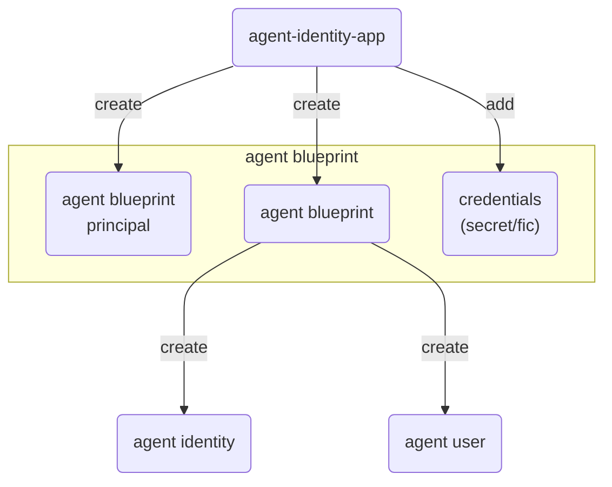

## 0. Prerequisites

References:
- [Create agent blueprint, agent blueprint principal, configure credentials for agent blueprint](https://learn.microsoft.com/en-us/entra/agent-id/identity-platform/create-blueprint)
- [Create agent identities](https://learn.microsoft.com/en-us/entra/agent-id/identity-platform/create-delete-agent-identities)

### 0.1. Provisioning application

The procedures writen below uses an application with the necessary [permissions required](/entra/agent-id#2-apis-and-permissions-requried-to-provision-entra-agent-identity-objects) to perform the provisioning


### 0.2. Staging the provisioning application

|Parameter|Value|
|---|---|
|`<tenant-id>`|Entra tenant ID|
|`<provisioning-app-id>`|App ID of the provisioning application|
|`<provisioning-app-secret>`|Client secret of provisioning application|

Get access token for the provisioning application with client credential flow and put it in `$header`

```pwsh
$tenant = '<tenant-id>'
$clientid = '<provisioning-app-id>'
$clientsecret = '<provisioning-app-secret>'
$token_endpoint = "https://login.microsoftonline.com/$tenant/oauth2/v2.0/token"
$body=@{
  client_id = $clientid
  client_secret = $clientsecret
  grant_type = 'client_credentials'
  scope = 'https://graph.microsoft.com/.default'
}
Invoke-RestMethod $token_endpoint -Method Post -Body $body | Tee-Object -Variable token
$headers = @{ Authorization='Bearer '+$token.access_token }
```

### 0.3. Provisioning flow



### 0.4. Get user id for sponsor and owner [ᵈᵒᶜ](https://learn.microsoft.com/en-us/graph/api/user-list)

Example using user UPN `admin@MngEnvMCAP398230.onmicrosoft.com`:

```pwsh
$userPN = 'admin@MngEnvMCAP398230.onmicrosoft.com'
$filter = "userPrincipalName eq '$userPN'"
$endpointuri = 'https://graph.microsoft.com/v1.0/users?$filter='+$filter
Invoke-RestMethod $endpointuri -Headers $headers | Tee-Object -Variable managerUser
```

### 0.5. Staging names

```pwsh
$AgentIdBpName = 'episilon-AgentIdentityBlueprint'
$AgentIdName = 'episilon-AgentIdentity'
$AgentUserName = 'episilon-AgentUser'
$AgentUserAlias = 'episilon-AgentUser'
$tenantDomain = 'MngEnvMCAP398230.onmicrosoft.com'
```

## 1. Agent blueprint

### 1.1. Create agent blueprint [ᵈᵒᶜ](https://learn.microsoft.com/en-us/graph/api/agentidentityblueprint-post)

```pwsh
$endpointuri = 'https://graph.microsoft.com/v1.0/applications/microsoft.graph.agentIdentityBlueprint'
$body=@{
  '@odata.type' = 'Microsoft.Graph.AgentIdentityBlueprint'
  displayName = $AgentIdBpName
  'sponsors@odata.bind' = @( "https://graph.microsoft.com/v1.0/users/$($managerUser.value.id)" )
  'owners@odata.bind' = @( "https://graph.microsoft.com/v1.0/users/$($managerUser.value.id)" )
}
Invoke-RestMethod $endpointuri -Method Post -Headers $headers -Body $($body | ConvertTo-Json) -ContentType 'application/json' | Tee-Object -Variable AgentIdBp
```

### 1.2. Create agent blueprint principal [ᵈᵒᶜ](https://learn.microsoft.com/en-us/graph/api/agentidentityblueprintprincipal-post)

```pwsh
$endpointuri = 'https://graph.microsoft.com/v1.0/serviceprincipals/graph.agentIdentityBlueprintPrincipal'
$body=@{
  appId = $AgentIdBp.id
}
Invoke-RestMethod $endpointuri -Method Post -Headers $headers -Body $($body | ConvertTo-Json) -ContentType 'application/json' | Tee-Object -Variable AgentIdBpPrincipal
```

### 1.3. Add agent blueprint credentials

#### 1.3.A. Client secret

##### 1.3.A.1. Add password [ᵈᵒᶜ](https://learn.microsoft.com/en-us/graph/api/agentidentityblueprint-addpassword)

```pwsh
$endpointuri = "https://graph.microsoft.com/v1.0/applications/$($AgentIdBp.id)/microsoft.graph.agentIdentityBlueprint/addPassword"
$body=@{
  passwordCredential = @{
    displayName = ''
  }
}
Invoke-RestMethod $endpointuri -Method Post -Headers $headers -Body $($body | ConvertTo-Json) -ContentType 'application/json' | Tee-Object -Variable AgentIdBpPw
```

##### 1.3.A.2. Delete password [ᵈᵒᶜ](https://learn.microsoft.com/en-us/graph/api/agentidentityblueprint-removepassword)

```pwsh
$endpointuri = "https://graph.microsoft.com/v1.0/applications/$($AgentIdBp.id)/microsoft.graph.agentIdentityBlueprint/removePassword"
$body=@{ keyId = $AgentIdBpPw.keyId }
Invoke-RestMethod $endpointuri -Method Post -Headers $headers -Body $($body | ConvertTo-Json) -ContentType 'application/json'
```

#### 1.3.B. Federated identity credentials (FIC)

##### 1.3.B.1. Get managed identity using list servicePrincipals [ᵈᵒᶜ](https://learn.microsoft.com/en-us/graph/api/serviceprincipal-list)

Example using Azure VM with name `delta-vm-winsvr`:

```pwsh
$miName = 'delta-vm-winsvr'
$filter = "servicePrincipalType eq 'ManagedIdentity' and displayName eq '$miName'"
$endpointuri = 'https://graph.microsoft.com/v1.0/servicePrincipals?$filter='+$filter
Invoke-RestMethod $endpointuri -Headers $headers | Tee-Object -Variable managedIdentity
```

##### 1.3.B.2. Add FIC [ᵈᵒᶜ](https://learn.microsoft.com/en-us/graph/api/federatedidentitycredential-post)

```pwsh
$endpointuri = "https://graph.microsoft.com/v1.0/applications/$($AgentIdBp.id)/microsoft.graph.agentIdentityBlueprint/federatedIdentityCredentials"
$body=@{
  name = 'azure-vm-mi-fic'
  issuer = "https://login.microsoftonline.com/$tenant/v2.0"
  subject = $managedIdentity.value.id
  audiences = @( 'api://AzureADTokenExchange' )
}
Invoke-RestMethod $endpointuri -Method Post -Headers $headers -Body $($body | ConvertTo-Json) -ContentType 'application/json'
```

##### 1.3.B.3. Delete FIC [ᵈᵒᶜ](https://learn.microsoft.com/en-us/graph/api/federatedidentitycredential-delete)

```pwsh
$endpointuri = "https://graph.microsoft.com/v1.0/applications/$($AgentIdBp.id)/microsoft.graph.agentIdentityBlueprint/federatedIdentityCredentials/$($body.name)"
Invoke-RestMethod $endpointuri -Method Delete -Headers $headers
```

## 2. Create agent identity [ᵈᵒᶜ](https://learn.microsoft.com/en-us/graph/api/agentidentity-post)

> [!Note]
>
> Use an agent blueprint access token to create agent identity; read: [get agent blueprint graph api access token](auth-flows.md#21-graph-api-access-token)

```pwsh
$endpointuri = 'https://graph.microsoft.com/v1.0/servicePrincipals/microsoft.graph.agentIdentity'
$body=@{
  displayName = $AgentIdName
  agentIdentityBlueprintId = $AgentIdBp.id
  'sponsors@odata.bind' = @( "https://graph.microsoft.com/v1.0/users/$($managerUser.value.id)" )
}
Invoke-RestMethod $endpointuri -Method Post -Headers $headersAgentIdBp -Body $($body | ConvertTo-Json) -ContentType 'application/json' | Tee-Object -Variable AgentId
```

## 3. Create agent user [ᵈᵒᶜ](https://learn.microsoft.com/en-us/graph/api/agentuser-post)

> [!Note]
>
> 1. Use an agent blueprint access token to create agent user; read: [get agent blueprint graph api access token](auth-flows.md#21-graph-api-access-token)
> 2. The agent blueprint requires `AgentIdUser.ReadWrite.IdentityParentedBy` application permission to create agent user with itself as parent; read: [grant create agent user permission to agent blueprint](permissions-and-consent.md#51-grant-create-agent-user-permission-to-agent-blueprint-ᵈᵒᶜ)

```pwsh
$endpointuri = 'https://graph.microsoft.com/beta/users/microsoft.graph.agentUser'
$body=@{
  accountEnabled = 'true'
  displayName = $AgentUserName
  mailNickname = $AgentUserAlias
  userPrincipalName = $AgentUserAlias+'@'+$tenantDomain
  identityParentId = $AgentId.id
}
Invoke-RestMethod $endpointuri -Method Post -Headers $headersAgentIdBp -Body $($body | ConvertTo-Json) -ContentType 'application/json' | Tee-Object -Variable AgentUser
```

## 4. Misc troubleshooing

### 4.1. Get things

#### 4.1.1. Get agentIdentityBlueprint [ᵈᵒᶜ](https://learn.microsoft.com/en-us/graph/api/agentidentityblueprint-list)

```pwsh
$filter = "displayName eq '$AgentIdBpName'"
$endpointuri = 'https://graph.microsoft.com/v1.0/applications/microsoft.graph.agentIdentityBlueprint?$filter='+$filter
$AgentIdBp = (Invoke-RestMethod $endpointuri -Headers $headers).value
```

#### 4.1.2. Get agentIdentityBlueprintPrincipal [ᵈᵒᶜ](https://learn.microsoft.com/en-us/graph/api/agentidentityblueprintprincipal-list)

```pwsh
$filter = "displayName eq '$AgentIdBpName'"
$endpointuri = 'https://graph.microsoft.com/v1.0/servicePrincipals/microsoft.graph.agentIdentityBlueprintPrincipal?$filter='+$filter
$AgentIdBpPrincipal = (Invoke-RestMethod $endpointuri -Headers $headers).value
```

#### 4.1.3. Get agentIdentity [ᵈᵒᶜ](https://learn.microsoft.com/en-us/graph/api/agentidentity-list)

```pwsh
$filter = "displayName eq '$AgentIdName'"
$endpointuri = 'https://graph.microsoft.com/v1.0/servicePrincipals/microsoft.graph.agentIdentity?$filter='+$filter
$AgentId = (Invoke-RestMethod $endpointuri -Headers $headers).value
```

#### 4.1.4. Get agentUser [ᵈᵒᶜ](https://learn.microsoft.com/en-us/graph/api/agentuser-list)

```pwsh
$filter = "displayName eq '$AgentUserName'"
$endpointuri = 'https://graph.microsoft.com/beta/users/microsoft.graph.agentUser?$filter='+$filter
$AgentUser = (Invoke-RestMethod $endpointuri -Headers $headers).value
```

### 4.2. Delete things

#### 4.2.1. Delete agentIdentityBlueprint [ᵈᵒᶜ](https://learn.microsoft.com/en-us/graph/api/agentidentityblueprint-delete)

> [!Tip]
>
> Agent blueprint principal is deleted when agent blueprint is deleted

```pwsh
$endpointuri = "https://graph.microsoft.com/v1.0/applications/$($AgentIdBp.id)/microsoft.graph.agentIdentityBlueprint"
Invoke-RestMethod $endpointuri -Method Delete -Headers $headers
```

#### 4.2.2. Delete agentIdentity [ᵈᵒᶜ](https://learn.microsoft.com/en-us/graph/api/serviceprincipal-delete?view=graph-rest-beta)

> [!Tip]
>
> Oddly, the agent identity isn't deleted when the agent bluepint is deleted
> 
> There also doesn't seem to be a docs for deleting agent identity, but deleting service prinicpal works

```pwsh
$endpointuri = "https://graph.microsoft.com/v1.0/serviceprincipals/$($AgentId.id)"
Invoke-RestMethod $endpointuri -Method Delete -Headers $headers
```

#### 4.2.3. Delete agentUser [ᵈᵒᶜ](https://learn.microsoft.com/en-us/graph/api/agentuser-delete)

```pwsh
$endpointuri = "https://graph.microsoft.com/beta/users/microsoft.graph.agentUser/$($AgentUser.id)"
Invoke-RestMethod $endpointuri -Method Delete -Headers $headers
```
